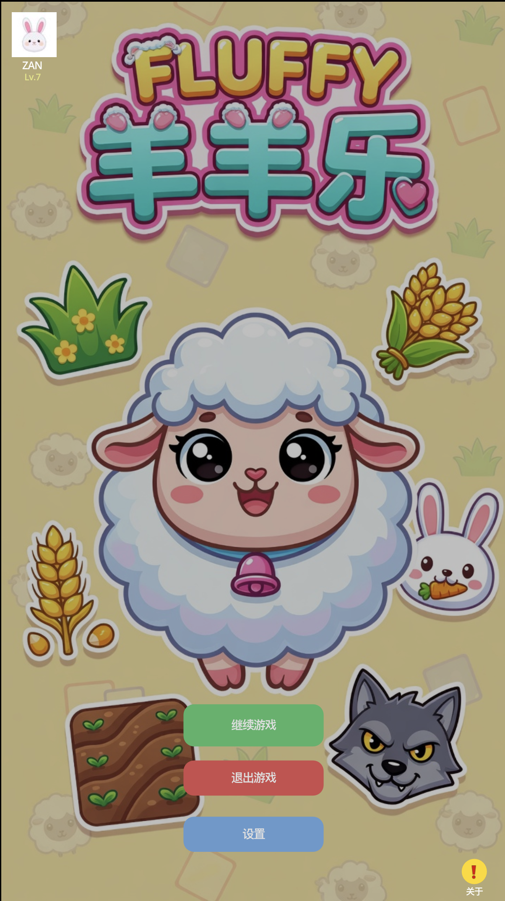

# 🐑 FLUFFY羊羊乐

经典休闲配对消除小游戏，类似《羊了个羊》。基于 Godot 4.6 开发。

## 游戏玩法

- 点击没有被覆盖的牌（free 状态）
- 选择两张相同类型的牌即可消除
- 消除所有卡牌通关
- 关卡越高，牌越多、堆叠越深，难度递增

## 特性

- ✅ 渐进式难度系统
- ✅ 可解布局生成算法（反向配对放置）
- ✅ 计时器 + 星级评分（≤3.5s/对=⭐⭐⭐）
- ✅ 玩家档案（用户名 + 头像）
- ✅ BGM 开关控制
- ✅ 洗牌和重来功能

## 下载

- [下载 APK v0.2.0](https://github.com/shizixian/FLUFFY/releases/tag/v0.2.0) — 手机直接安装即可

## 截图

| 主菜单 | 游戏画面 |
|:---:|:---:|
|  |  |

- 项目完全开源

## 开发

- **引擎**: Godot 4.6.3
- **语言**: GDScript
- **分辨率**: 720×1280 竖屏

### 运行

用 Godot 4.6.3 打开项目，F5 运行。

### 导出 Android

1. 安装 Android SDK + Java 21
2. 项目 → 导出 → 选择 Android 预设 → 导出 AAB

## 致谢

- 作者：ShiZixian (Zan)
- 编程协助：Grok & Claude Code

## License

MIT
